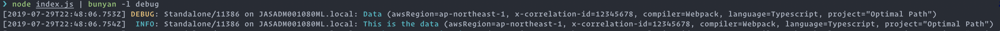

## AWS-BUNYAN


#### Introduction

aws-bunyan is **a simple and fast JSON logging library** for node.js services. It wraps [bunyan](https://www.npmjs.com/package/bunyan) providing a very focused and simple API, with the ability to set context data into the logger at runtime - for instance correlationIds.

This library shines when used in conjunction with AWS Lambda, Cloudwatch, and ECS (ElasticSearch).

Manifesto: Server logs should be structured. JSON's a good format. Let's do
that. A log record is one line of `JSON.stringify`'d output. Let's also
specify some common names for the requisite and common fields for a log
record (see below).

#### Example Usage

Here's a snippet (typescript):

```ts
import { ILogger, logFactory } from "aws-bunyan";
const log: ILogger = logFactory.createLogger("MyLogger");

const data = { compiler: "Webpack", language: "Typescript" };
log.debug("Data", data);
```

With typings support:


Since this is a lightweight wrapper around bunyan, you can fully leverage the bunyan CLI for nicely viewing those logs too.




#### Setting Context

Frequently, there is a need to group logs together by request etc. A way to achieve this is to retrieve a unique correlation id (AWS provides a couple of ways of getting this during AWS Lambda requests for example), and associate this correlation id with every log statement originating from that specific request.

Here is a snippet:

```ts
import { ILogger, logFactory } from "aws-bunyan";
const log: ILogger = logFactory.createLogger("MyLogger");

// get the unique correlation id somehow...
const uniqueCorrelationId = "12345678";

log.setContext("x-correlation-id", uniqueCorrelationId);

const data = { compiler: "Webpack", language: "Typescript" };
log.debug("Data", data);
```

And here's the output:


#### Serializer Support

You can easily add your own [serializers](https://www.npmjs.com/package/bunyan#serializers).

For example, let's suppose you want a serializer that masks personally identifiable information (PII).
Simply write your serializer (eg. maskPII).

Example usage:

```ts
import { ILogger, logFactory } from "aws-bunyan";
import maskPII from "./maskPII";

const log: ILogger = logFactory.createLogger("Standalone", {
  maskPII
});

log.info("Phone number, Question & Answer", {
  maskPII: {
    answer: "tablet",
    phonenumber: "080 12345678",
    question: "device type"
  }
});

```

And here's the output:


#### Setting Log Level

Simple:

```js
process.env.LOG_LEVEL = "DEBUG";
```

#### Example Usages Of Logger API

Just some simple usages to guide you (typescript):

```ts
import { ILogger, logFactory } from "aws-bunyan";

const log: ILogger = logFactory.createLogger("MyLogger");

const data = { compiler: "Webpack", language: "Typescript" };
log.debug("Data", data);

log.debug("Data", data);

log.info("This is the data", data);

const warningError = new Error(
  "Database disconnected unexpectedly. Retrying..."
);

log.warn("Database connection issue", data, warningError);

const fatalError = new Error("Database is offline.");

log.error("Fatal error, aborting.", data, fatalError);
```

#### Finally

Check the [bunyan](https://www.npmjs.com/package/bunyan) docs for further details if unsure.
